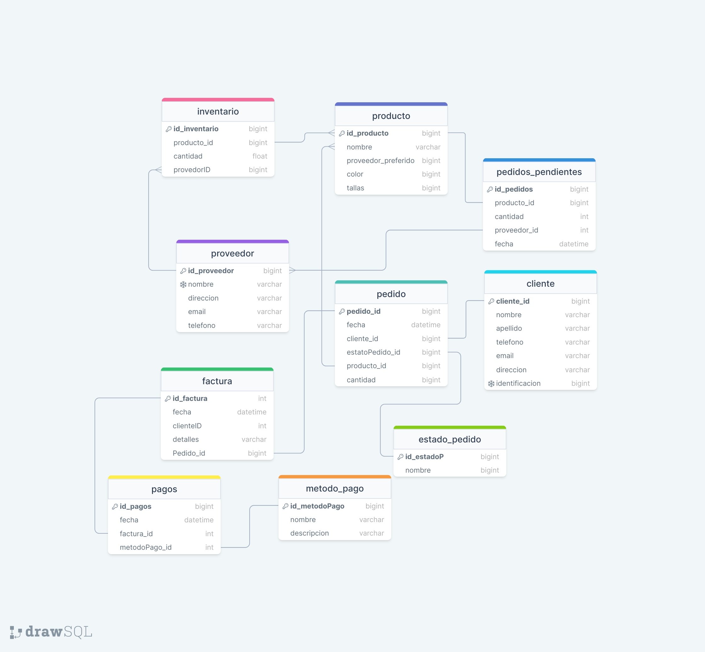

# EJERCICIO 2_1 Base de datos relacionales-Ejercicio dos 
En este Readme contiene la informacion pertinente del ejercicio de base de datos
## Que contiene este repositorio? 
El repositorio contendra la informacion pertinente de los modelos utilizados para la realizacion de este proyecto, ademas de poseer un readme con toda la informacion pertinente de la base de datos expuesta

* Contiene la infomacion del sql llamado `segundoPunto.sql` en el que a partir de este se realizo un diagrama fisico que se expondra en los siguientes puestos de informacion.

### Los modelos a trabajar son:

- Modelo conceptual
- Modelo Logico
- Modelo fisico

### Como se trabajara
A partir de los tres modelos demostrados anteriormente se trabajaran de la siguiente manera.

Primero planteamos una idea Preliminar para determinar el concepto o las ideas que quereamos plantear en la estructura de la base de datos y de las gestion de alquiler de los vehiculos
A partir de la logica enunciada en el cual se planteara el problema a solucionar o la idea que queramos plantear se desarrollara una lluvia de ideas por parte del usuario/cliente para suplir las necesidades expuestas.
A partir de la infomacion planteada generamos un modelo fisico conteniendo las entidades y atributos de cada tabla.
### Modelo conceptual 
 
1. cliente: 
   - id_cliente (identificador del cliente) 
 
2. pedido: 
   - id_pedido (identificador del pedido) 
 
3. producto: 
   - id_producto (identificador del producto) 
 
4. pagos: 
   - id_pagos (identificador de los pagos) 
 
5. estado_pedido: 
   - id_estadoPedido (identificador del estado del pedido) 
 
6. metodo_pago: 
   - id_metodoPago (identificador del metodo de pago) 
 
7. factura: 
   - id_factira (identificador de la factura) 
 
8. proveedor: 
   - id_proveedor (identificador del proveedor) 

9. pedidos_pendientes: 
   - id_pedidos (identificador de los pedidos pendientes) 
10. inventario:
   - id_inventario (identificador del inventario)
 
Este modelo conceptual muestra las entidades principales y sus respectivos identificadores en el contexto de un negocio de alquiler y venta de libros. 

### Modelo Fisico 
Este modelo físico representa la estructura de la base de datos, mostrando las tablas, sus relaciones y los atributos clave que las componen

